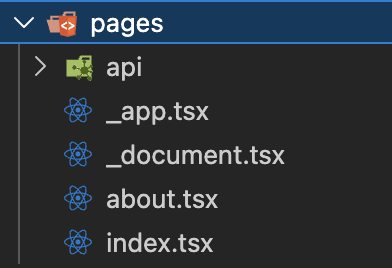
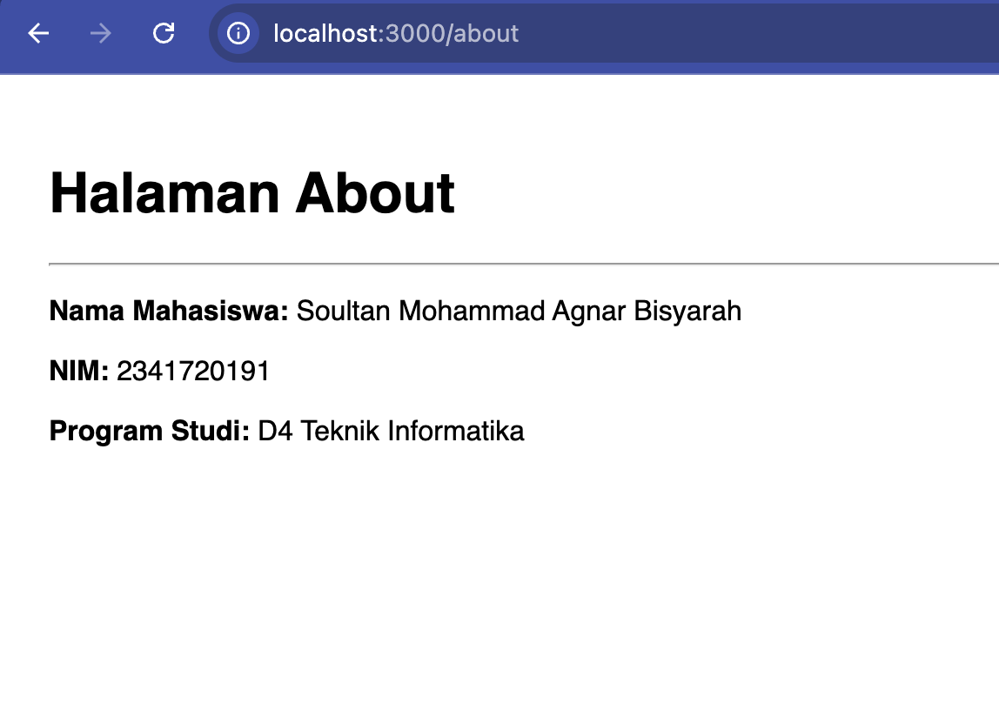
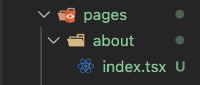
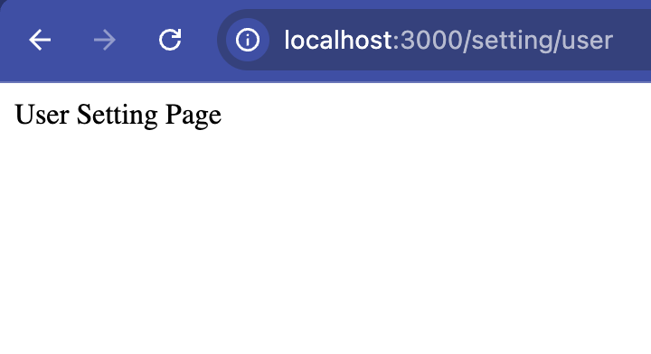
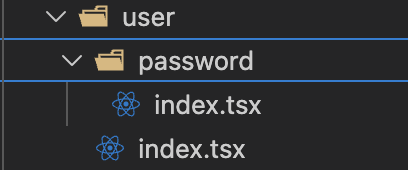

# Pertemuan 2

**Praktikum 1 : Routing Dasar (Static Routing)**

1. Ubah Struktur



2. Hasil Uji

<br><br>

**Praktikum 2 : Routing Menggunakan Folder**

1. Rapikan Struktur Page



2. Uji coba (hasil tetap sama tapi lebih rapi)

<br><br>

**Praktikum 3 : Nested Routing**

1. Buat Folder Setting


2. Modifikasi Kode nya

- user.tsx

```tsx
const UserSettingPage = () => {
    return(
    <div>
        User Setting Page
    </div>
    );
};

export default UserSettingPage;
```

<br><br>

- app.tsx

```tsx
const AppSetting = () => {
    return(
    <div>
        App Setting Page
    </div>
    );
};

export default AppSetting;
```

<br><br>

3. Modifikasi Struktur


4. Menambahkan Folder Password di dalam User

<br><br>

**Praktikum 4 : Dynamic Routing**

1. Buat Halaman Produk

 └── produk/
    ├── index.tsx
    └── [id].tsx

2. Modifikasi index.tsx

```tsx
const produk = () => {
    return(
        <div>
            Produk User Page
        </div>
    );
};

export default produk;
```

3. Modifikasi [id].tsx

```tsx
import {useRouter} from 'next/router';

const HalamanProduk = () => {
    // const router = useRouter();
    // console.log(router);
    const {query} = useRouter();
    return(
        <div>
            <h1>Halaman Produk</h1>
            <p>Produk : {query.id}</p>
        </div>
    );
};

export default HalamanProduk;
```

4. Uji coba /produk/sepatu-baru

<br><br>

**Praktikum 5 : Membuat Komponen Navbar**

1. Struktur Komponen
src/
└── components/
 └── layouts/
    └── Navbar/
        └── index.tsx

2. Modifikasi index.tsx

```tsx
const Navbar = () => {
    return(
        <div className="navbar">
            <div>Navbar Component</div>
        </div>
    );
};

export default Navbar;

```
3. Modifikasi global.css

```css
* {
  box-sizing: border-box;
  padding: 0;
  margin: 0;
}

html,
body {
  max-width: 100vw;
  overflow-x: hidden;
}

a {
  color: inherit;
  text-decoration: none;
}

.navbar{
  width: 100%;
  height: 60px;
  background-color: #333;
  color: white;
  display: flex;
  align-items: center;
  padding: 0 20px;
}
```

4. Modifikasi index.tsx pada folder pages

```tsx
import Navbar from '@/components/layouts/navbar'

const inter = Inter({ subsets: ['latin'] })
export default function Home() {
  return (
  
    <div>
      <Navbar />
      <h1>Praktikum Next.js Pages Router</h1> 
      <p>Mahasiswa D4 Pengembangan Web</p>
    </div>
  );
}
```

5. Modifikasi _app.tsx

```tsx
import '@/styles/globals.css'
import type { AppProps } from 'next/app'

export default function App({ Component, pageProps }: AppProps) {
  return <Component {...pageProps} />
}
```
6. Tampilan Browser


7. Modifikasi agar tampil global

```tsx
import '@/styles/globals.css'
import Navbar from '@/components/layouts/navbar'
import type { AppProps } from 'next/app'

export default function App({ Component, pageProps }: AppProps) {
  return (
    <>
      <Navbar />
      <Component {...pageProps} />
    </>
  )
}
```

**Praktikum 6 : Membuat Layout Global (App Shell)**

1. Struktur AppShell

 └── AppShell
    ├── Navbar (tetap)
    └── Children (dinamis)
